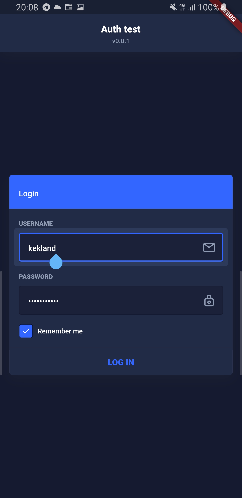
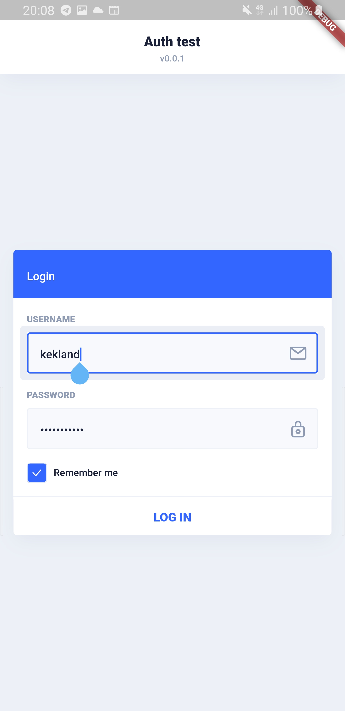
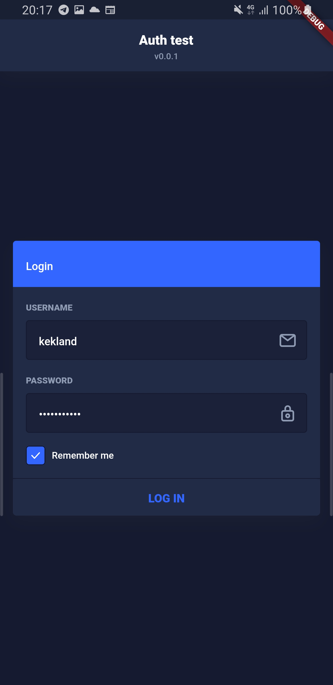
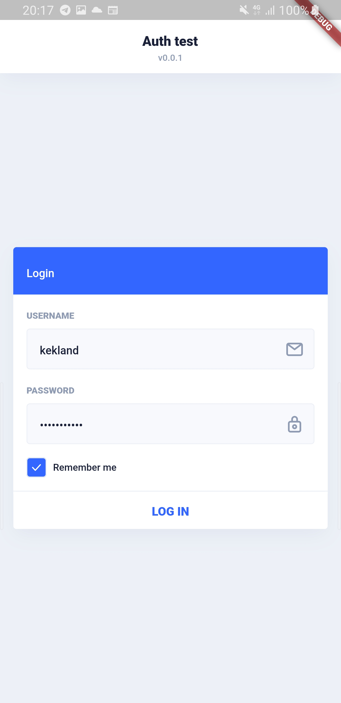

# equinox 

A [**Eva Design**](https://eva.design) implementation in Flutter.

## Work in progress:

- [x] Theming
- [x] AppBar
- [x] Card
- [ ] Stepper
- [ ] Accordion
- [ ] Sidebar
- [ ] Menu
- [ ] Tabs
- [x] Input
- [x] Button
- [x] IconButton
- [x] Checkbox
- [x] Toggle
- [x] Radio
- [ ] Select
- [ ] Dialog
- [ ] Toast
- [ ] Avatar
- [ ] Spinner
- [ ] Progress Bar
- [ ] Badge

## Screenshots

  
  
  
   

## Other Eva Design implementations

- [**Angular**](https://github.com/akveo/nebular)
- [**React Native**](https://github.com/akveo/react-native-ui-kitten)

## Icons

Get the icon pack from [here](https://github.com/piyushmaurya23/eva_icons_flutter).

## Credits

- Eva Design Team: [Repository](https://github.com/eva-design/eva)

## Contact me

**E-Mail**: `kk.erzhan@gmail.com`